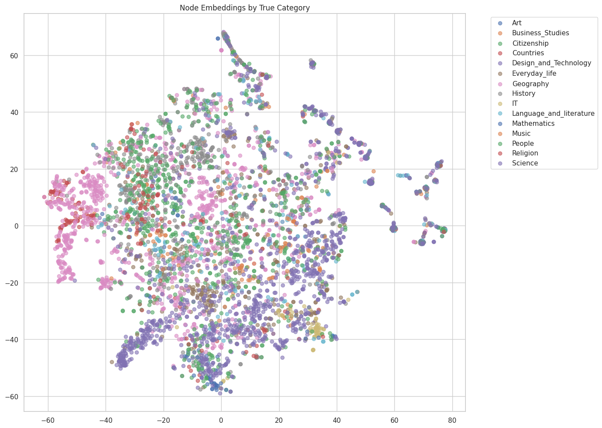
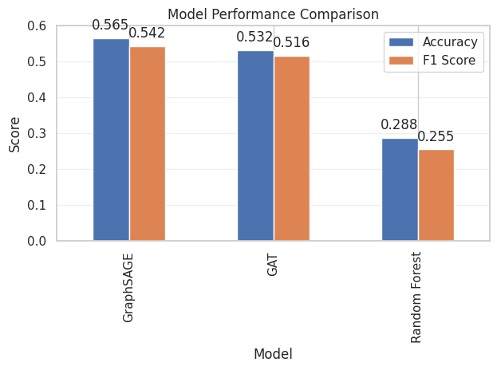
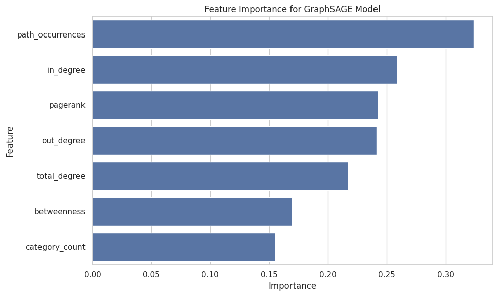

# Wikipedia Article Classification with Graph Neural Networks

## Project Overview
This is the official repository for the HKUST MSBD5008 Social Computing project, focused on Wikipedia Article Classification using Graph Neural Networks.

## Problem Description
This project addresses the task of automatically classifying Wikipedia articles into appropriate categories by leveraging the inherent graph structure of Wikipedia. By representing articles as nodes in a graph with links between them as edges, we utilize Graph Neural Networks to improve classification accuracy beyond traditional text-based approaches.


## Dataset
The dataset consists of Wikipedia articles represented as a graph:

- articles.tsv: Wikipedia articles
- links.tsv: Hyperlinks between articles
- categories.tsv: Article categories
- paths_finished.tsv: The finished paths information
- paths_unfinished.tsv: The unfinished paths information

## Methodology

### Feature Engineering
We extract rich features from multiple sources:

- Graph Topology Features
    - PageRank (π): importance of articles in the network  
    - Betweenness centrality (C<sub>B</sub>(v)): articles that bridge different parts of the graph  
    - In-degree (d<sub>in</sub>(v)) and out-degree (d<sub>out</sub>(v)): incoming/outgoing links  
    - Total degree (d(v)): overall connectivity  

- Path-based Features
    - Frequency of articles in navigation paths  
    - Path occurrence patterns  

- Category-based Features
    - Category distribution metrics  
    - Number of categories per article  

    *All features are normalized using StandardScaler to ensure model stability.*

### Graph Neural Network Models
We implement and compare two GNN architectures:

- Graph Attention Network (GAT)
    - **Architecture**: Multiple GAT layers with multi-head attention 

    - **Enhancements**:
        - Layer normalization for feature stability  
        - Residual connections to prevent gradient vanishing  
        - Dropout for regularization  
        - Enhanced feature preprocessing  

- GraphSAGE
    - **Architecture**: Multiple SAGEConv layers for message passing

    - **Enhancements**:
        - Batch normalization between layers  
        - Multiple aggregation steps for wider neighborhood information  
        - Parameter-optimized activation functions  

### Training and Evaluation Pipeline
- **Data Splitting**: Stratified train/validation/test splits to maintain class distribution  
- **Training Strategy**:
    - Adam optimizer with weight decay  
    - Learning rate optimization  
    - Early stopping based on validation F1 score  
    - Optional data augmentation with Gaussian noise  
- **Hyperparameter Tuning**:
    - Grid search over key parameters  
    - Systematic evaluation of model variants  
    - Performance tracking across multiple metrics  

### Comparative Analysis
We compare our GNN models against traditional ML baselines:
- Random Forest classifier (non-graph approach)  
- Feature importance analysis to understand predictive factors  
- Performance evaluation using accuracy, F1 score, and confusion matrices  

### Node Embedding Visualization
We visualize the learned embeddings using t-SNE to analyze:
- Category clustering in the latent space  
- Misclassification patterns  
- Network structure captured by the models  

    *This comprehensive methodology leverages both graph structure and node features to achieve superior classification performance compared to traditional approaches.*

## Installation

```bash
git clone https://github.com/HKUST-Franky/MSBD5008_Social_Computing.git
cd MSBD5008_Social_Computing

# Create and activate a virtual environment (optional but recommended)
conda create -n graph python=3.10
conda activate graph

# Install dependencies
pip install -r requirements.txt
```

## Overview Results
The Node Embedding of True Category


The Model Performance Comparison


The Feature Importance for Best Model



